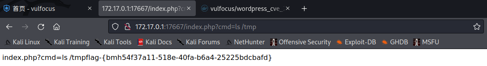

Vulfocus学习记录
<!--more-->

### Vulfocus搭建
Vulfocus 是一个漏洞集成平台，将漏洞环境 docker 镜像，放入即可使用，开箱即用。账号密码为admin admin。
```
docker pull vulfocus/vulfocus:latest
docker create -p 80:80 -v /var/run/docker.sock:/var/run/docker.sock -e VUL_IP=docker_ip vulfocus/vulfocus
docker container start id
```
从https://hub.docker.com/u/vulfocus拉取需要的漏洞镜像开始复现。


### 命令执行

<!-- #### weblogic-cve_2020_2551 -->

<!-- #### 其他 -->
- vulshare/nginx-php-flag
按提示拼接url
<div align=center></div>

<!-- ### 远程代码执行
laravel-cve_2021_3129
- 概述：Laravel是一套简洁、开源的PHP Web开发框架，旨在实现Web软件的MVC架构。Laravel开启了Debug模式时，由于Laravel自带的Ignition 组件对file_get_contents()和file_put_contents()函数的不安全使用，攻击者可以通过发起恶意请求，构造恶意Log文件等方式触发Phar反序列化，最终造成远程代码执行。 -->
