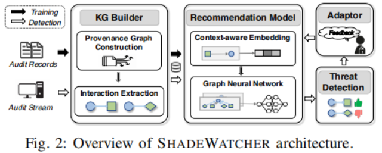
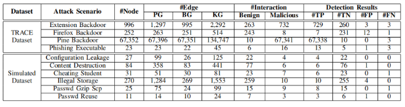
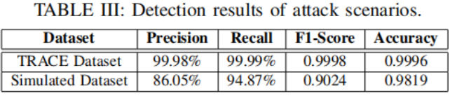

使用系统审计记录进行推荐的网络威胁分析
<!--more-->

> 原文标题： SHADEWATCHER: Recommendation-guided Cyber Threat Analysis using System Audit Records  
> 原文作者：Zeng J, Wang X, Liu J, et al.  
> 发表会议：2022 IEEE Symposium on Security and Privacy (SP)  
> 原文链接：https://jun-zeng.github.io/file/shadewatcher_paper.pdf  

## 简介
现有的系统审计存在局限性：1)大量假告警，2)依赖于专家知识，3)检测信号不精确。论文受网络安全中的威胁检测与信息检索中的推荐之间的结构相似性启发，将系统-实体交互映射为用户-项目交互的推荐概念来识别网络威胁。SHADEWATCHER通过图神经网络挖掘审计记录中的深层信息，实验证明有更高的精度和召回率。

## 方法

SHADEWATCHER架构如图所示，主要包括四个阶段：构建知识图谱(KG)、生成推荐模型、检测网络威胁和调整模型。
- KG builder：首先将系统审计记录转换为一个来源图(PG)，节点表示具有一组属性的系统实体，边描述系统实体之间的因果依赖关系和记录出现的时间戳。交互信息抽取模块将数据对象与其交互实体之间的交互抽取为一个二部图(BG)，BG中两个不相交的节点集是数据对象和系统实体，连接两个集合的边反映了相互作用。最后通过实体对齐将PG和BG组合成一个KG。
- 推荐模型：首先对一阶信息（KG中的一跳连接，例如，/etc/passwd−r1→gtcache）进行建模，通过TransE将系统实体转化为向量表示。然后通过GNN学习来自多跳相邻实体的信息来更新系统实体表示（高阶信息建模）。
- 威胁检测：将实体划分为正常实体和对抗实体，通过计算两实体的向量表示的内积预测二者间交互的可能性，若概率大于阈值则定义为网络威胁。
- 模型调整：分析人员可以将识别的假告警作为新负样本重新训练模型。

## 实验
采用公开数据集DARPA TRACE和之前工作中的模拟攻击数据集，实验表明，SHADEWATCHER检测威胁的精度较高，误报率分别为0.332%和0.137%。

