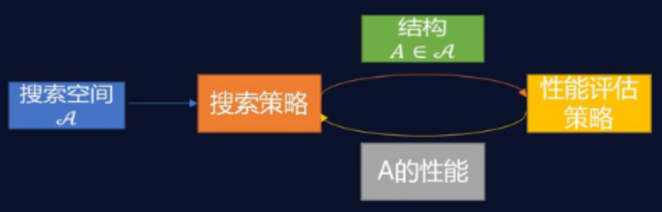
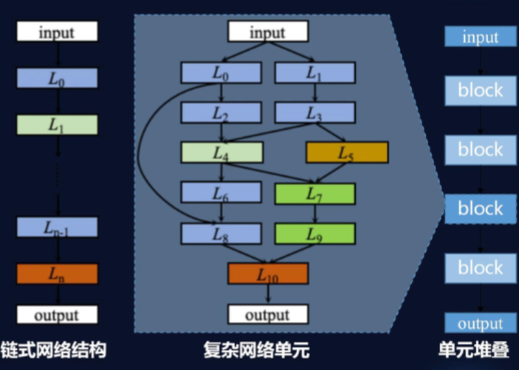
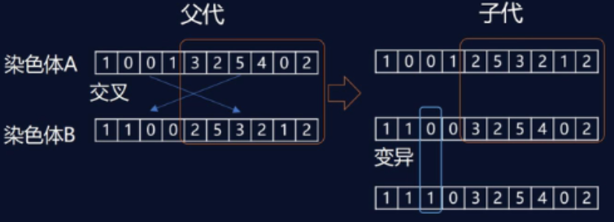
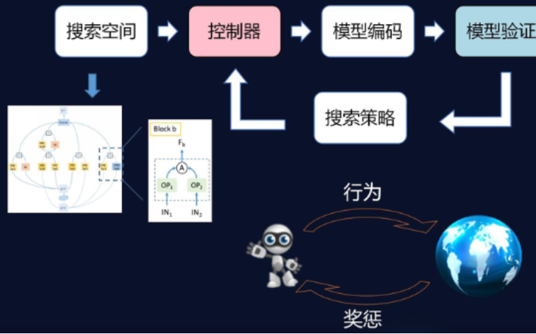
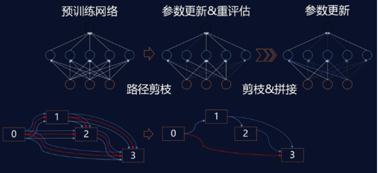

# Note-AutoML

AutoML框架学习记录
<!--more-->

# AutoML
## 介绍
1. **定义**：AutoML可以被定义为一组工具，可以使机器学习解决问题的过程自动化。其中包括数据预处理，特征工程，模型选择与参数优化等过程。  
2. **三要素**：搜索空间、搜索策略、评估准则  
3. 分类：针对传统机器学习、针对深度学习
4. 工具库:
    - H2O AutoML：基于Python环境和R环境下的结构化自动机器学习库，支持分布式部署。
    - MLBox：快速读取和分布式数据预处理/清理/格式化，深度学习，堆叠网络，LightGBM等。
    - **AutoGluon**：亚马逊发布，涵盖图像、文本或表格数据等实际应用。

## 传统机器学习AutoML
通常基于bagging或boosting算法的集成学习模型能取得较好的表现效果，e.g., RandomForest, XGBoost, LightGBM
```
rf = RandomForestClassifier()
param = {"n_estimators": [20, 30, 40, 60, 80], "max_depth": [25, 35, 45, 55]}
gc = GridSearchCV(rf, param_grid=param, cv=5)
gc.fit(self.x_train.values, self.y_train)
```


## 深度学习AutoML
<div align=center></div>

- **搜索空间表示**
  - 最大网络层数
  - 每层可选的元操作
  - 与操作相关的超参数
  <div align=center></div>

- **搜索策略**
  - 进化计算
  <div align=center></div>

  - 强化学习NAS
  <div align=center></div>

  - 网络迁移
  <div align=center></div>

## AutoGluon
### 功能
- TabularPredictor
    - 特征矩阵预测
    - 主要基于传统机器学习模型，也可以处理包含文本、数字和分类列的数据表
- MultiModalPredictor多模态预测
    - 融合多个神经网络模型并处理原始文本，也能处理额外的数字列
    - 文本：文本分类；提取嵌入向量；文本相似性；命名实体识别
    - 图像分类
    - 混合数据
    - 目标检测
- TimeSeriesPredictor时间序列预测


### 安装
```pip3 install autogluon```

### 使用
- TabularPredictor
 ```
from autogluon.tabular import TabularPredictor
predictor = TabularPredictor(label='label', path=save_path).fit(train_data, presets='best_quality')
y_pred = predictor.predict(test_data)
 ```
- MultiModalPredictor处理文本-情感分析
 ```
from autogluon.multimodal import MultiModalPredictor
predictor = MultiModalPredictor(label='label', eval_metric='acc', path=model_path).fit(train_data, time_limit=180) #time_limit运行时间限制
y_pred = predictor.predict(test_data)

#输出评估指标
test_score = predictor.evaluate(test_data, metrics=['acc', 'f1']) 
#提取嵌入
embeddings = predictor.extract_embedding(test_data)
#追加训练
predictor.fit(train_data_2, time_limit=180)
 ```
- MultiModalPredictor处理文本-NER
 ```
'''
数据
text_snippet，entity_annotations
what movies star bruce willis,[{"entity_group": "B-ACTOR", "start": 17, "end": 22}, {"entity_group": "I-ACTOR", "start": 23, "end": 29}]
'''
from autogluon.multimodal import MultiModalPredictor
predictor = MultiModalPredictor(problem_type="ner", label='entity_annotations', path=model_path).fit(train_data, time_limit=180) #time_limit运行时间限制
y_pred = predictor.predict(test_data)
 ```

- 自定义autogluon   
  - 训练次数hyperparameters={"optimization.max_epochs": 10}
  - 环境
    - hyperparameters={"env.num_gpus": -1}，默认所有gpu可参与训练
    - hyperparameters={"env.batch_size": 128}批处理大小
    - hyperparameters={"env.num_workers": 4}工作进程数
  - 数据
    - 缺失值处理策略：skip跳过或zero置零
    - 数据规范化
 ```
predictor.fit(hyperparameters={...})
 ```

- 官方文档：https://auto.gluon.ai

