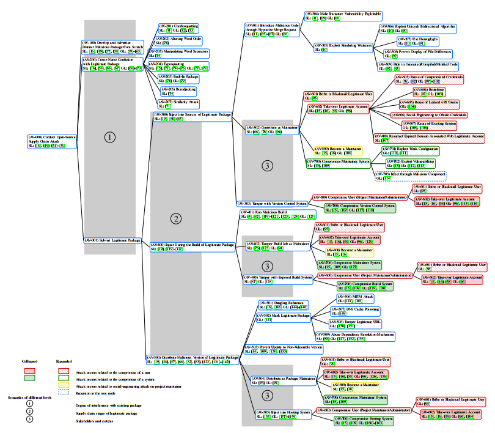
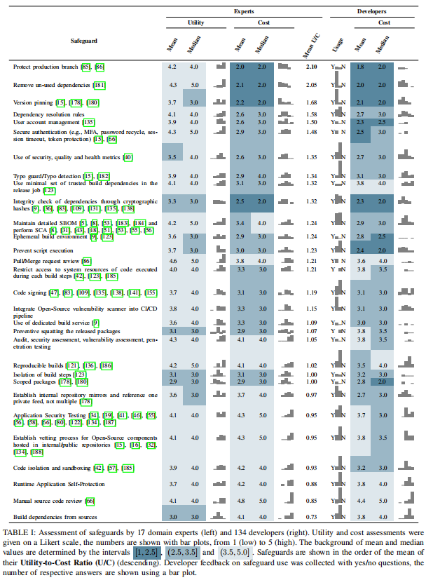

# Paper Reading-Supply Chain

开源软件供应链攻击分类
<!--more-->

> *原文标题：Taxonomy of Attacks on Open-Source Software Supply Chain*
>
> *原文作者：Piergiorgio Ladisa, Henrik Plate, Matias Martinez, Olivier Barais*
>
> *原文链接：https://arxiv.org/pdf/2204.04008.pdf*
>
> *原文来源：S&P'22*

## 简介
现有研究缺乏对攻击者如何将恶意代码注入OSS项目的全面、可理解、通用性的描述。论文关注开源软件供应链攻击，提出了一种针对开源供应链攻击的通用分类法，独立于特定的编程语言或生态系统，涵盖了从代码贡献到包分发的所有阶段，与真实事件关联并映射到安全缓解措施。邀请了17名领域专家和134名开发者对分类和相应安全措施的有效性进行定性评估。 

## 方法
首先，作者回顾了相关论文和灰色文献，以收集OSS供应链上的攻击载体的广泛列表。其次，将文献中描述的向量从特定的编程语言或生态系统中提取出来，进行威胁建模，并确定减轻这些向量的安全措施。最后，为了验证所提出的分类和安全措施列表，作者设计并运行了两个用户调查：OSS供应链安全领域的专家调查和软件开发人员调查。

- 文献数据：搜索四个数字图书馆：Google scholar（980）、arXiv（6）、IEE Explore（25）和ACM数字图书馆（160）。人工提取有关常见威胁、攻击载体和相关保障措施的信息。灰色文献主要来自开源数据集和安全博客。
- 攻击场景的分析与建模：基于文献[1]的攻击树，确定了额外的攻击向量。
  - 构建标准：对现有生态系统（一级节点）的干扰程度、软件供应链的各个阶段（即源、构建、分发），以及每个阶段所涉及的系统和利益相关者。
  - 模型如图1所示，一级节点包括开始创建恶意软件包、创建名称混淆的恶意软件包、转化合法软件包。转化合法软件包节点下包括三个二级节点：恶意代码注入、包构建时注入、分发恶意版本软件包。
  

- 安全措施的识别和分类：根据控制类型、利益相关者参与和减轻攻击向量对每个安全措施进行分类。控制类型分类遵循众所周知的指令、预防、检测、纠正和恢复控制。利益相关者包括维护者、系统管理员、用户。最后，每个安全措施被分配给可能的深度最小的树节点。(附录表II)
  - 针对项目维护人员和管理人员：包括八项保障措施，例如，安全身份验证建议服务提供商提供多因素身份验证(MFA)或强制执行强密码策略
  - 针对项目维护人员：包括七项对策，例如，维护者应该进行仔细的合并请求审查或为敏感的项目分支启用分支保护规则，以避免恶意的代码贡献。
  - 针对管理者和消费者：包括五种对策，例如，包存储库管理员和消费者都可以选择直接从源代码中构建包，而不是接受预先构建的工件。
  - 针对消费者：包括下游用户可能采用的九种应对措施。OSS包的用户可以通过隔离代码和/或沙箱来减少使用时恶意代码执行的影响。
- 用户调查：
  - 收集调查参与者背景信息尤其是技能，tree-testing验证树节点关系，用Likert scale对结构、节点名称、覆盖率和有效性进行评分。
  - 开发人员：参与者被问及他们是否知道此类攻击，以及他们或他们的组织是否使用了任何减轻罪行的安全措施。
  - 采用滚雪球抽样由最初的参与者分析邀请
  - 调查结果文件分布式存储在云端

## 评估
论文对提出的攻击分类和安全措施进行了全面评估  
A. 攻击分类评估  
- 专家评估：树形测试攻击树结构合理性(75%的节点结构合理)、Likert评分(82%的专家打分在4-5分)、72%的专家同意攻击树的完整性。
- 开发者评估：开发者是否了解主要攻击向量(64%-90%不等)、Likert评分(77%认为分类法可理解，87%认为分类法有帮助意义)

B. 安全措施评估  
- 从U/C比(Utility-to-Cost)角度打分，结果如表1所示

## 讨论
不同生态系统之间存在区别，一些攻击技术确实独立于特定的生态系统/语言，但一些攻击或检测方法是特定的，例如：滥用依赖解析攻击、执行或触发恶意代码、代码混淆和恶意软件检测。

## 总结
论文通过对现有工作进行总结和抽象，将开源软件供应链安全的知识系统化，并做了大量工作评估分类的有效性。提出的针对开源供应链攻击的分类法和安全缓解措施，有助于评估开源项目的安全风险、制定安全策略。

[1]. M. Ohm, H. Plate, A. Sykosch, and M. Meier, “Backstabber’s knife collection: A review of open source software supply chain attacks,” 2020.
