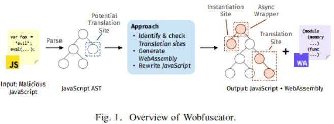
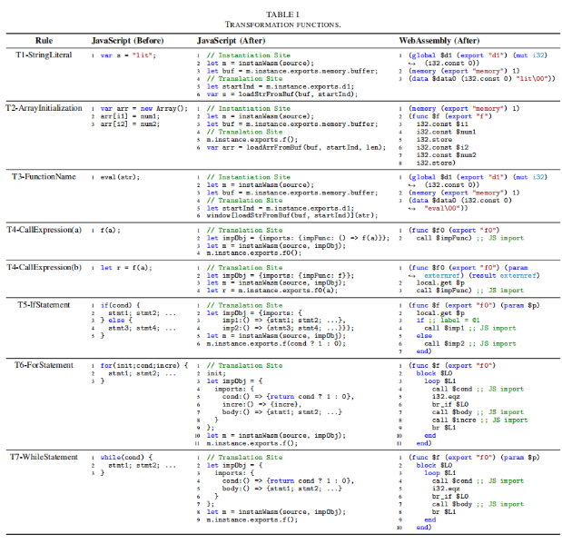
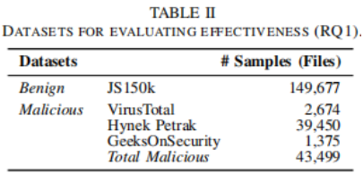
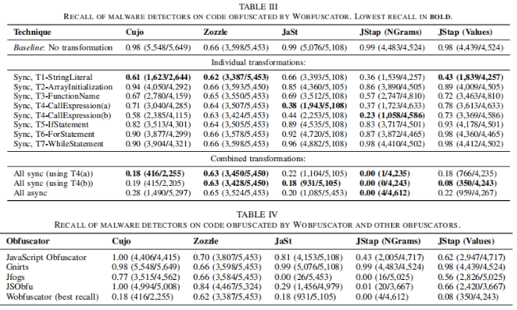
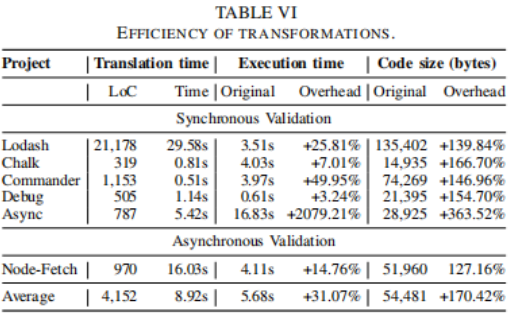

# Paper Reading-JS

将部分JavaScript恶意代码转换为WebAssembly以逃避检测
<!--more-->
> 原文标题：Wobfuscator: Obfuscating JavaScript Malware via Opportunistic Translation to WebAssembly  
> 原文作者：Romano A, Lehmann D, Pradel M, et al.  
> 发表会议：Proceedings of the 2022 IEEE Symposium on Security and Privacy (S&P 2022)   
> 原文链接：https://www.software-lab.org/publications/sp2022.pdf  

## 简介
目前的检测器以JavaScript为唯一的目标语言，然而忽略了WebAssembly可能带来的攻击。论文提出了第一个通过将计算的部分移动到WebAssembly中来逃避静态JavaScript恶意软件检测的技术。技术的核心是将JavaScript中实现恶意行为的片段翻译为WebAssembly。通过实验评估，该方法可以有效逃逸最先进的基于学习的静态恶意软件检测。

## 背景
JavaScript存在问题：JavaScript中的每条指令都要经过几次类型检查和转换，这会影响到它的执行速度。JavaScript不是为CPU密集型和高性能应用程序开发的，在WebAssembly发布前，JavaScript是客户端浏览器的唯一语言。  
WebAssembly（WASM）：可以将任何高级语言编写的代码转换为浏览器可理解的机器码的技术，帮助简化编译过程，为用C和C++等语言编写的计算密集型库提供了一个有效的编译目标。

## 方法
Wobfuscator的整体架构如图1所示，shut为一个JavaScript文件，作者将其解析为AST，接下来，该方法识别潜在的转换片段(i)与检测相关的恶意代码和(ii)可以以保留语义的方式转换为WebAssembly的代码（该方法不是通用转换，只针对满足以上两点要求的代码片段）。最后输出转换后的JavaScript代码和多个生成的WebAssembly模块

- 转换规则：作者定义了针对JavaScript不同特性的七个转换规则，如表1所示。七个转换规则可以大致分为三类：混淆数据、混淆函数调用和混淆控制流。

- 实例化模块：对于以上七个转换规则，作者开发了两个变体用于同步和异步实例化WebAssembly模块。其中异步实例化可以不受浏览器对模块大小的限制并且可以将生成的模块放在单独的文件中。
- 应用转换：主要包含三个步骤(a)识别能应用转换的AST节点；(b)通过修改可转换片段根节点的子树重写AST；(c)向AST根节点添加代码实例化WebAssembly模块。

## 实验
作者使用Node.js和Typescript实现Wobfuscator，使用数据集如表2所示。

在Cujo、Zozzle、JaSt、JStap四个流行的静态JavaScript检测器上测试了Wobfuscator的有效性，同时与四种开源的JavaScript混淆工具进行了比较。

转换的正确性和运行效率

## 局限性
- Wobfuscator针对基于静态分析的恶意软件检测器可以有效地绕过，但对于基于动态分析的检测器可能不起作用。
- 该方法只对满足要求的代码片段可以应用转换。
- 浏览器需要支持WebAssembly。

## 缓解策略
- 使用基于动态分析的恶意软件检测：作者提出的方法仍保留了原始的JavaScript恶意行为，动态检测器关注的运行特性不受混淆影响。
- 基于Wobfuscator提及的转换规则设计检测规则：防御者可以基于对混淆细节的了解，定义相应的规则进行检测。但混淆代码不一定是恶意的，例如保护知识产权，直接将混淆技术分类为恶意可能导致大量误报。
- 联合分析JavaScript和WebAssembly：联合分析数据和控制流如何在JavaScript和WebAssembly之间流动。
