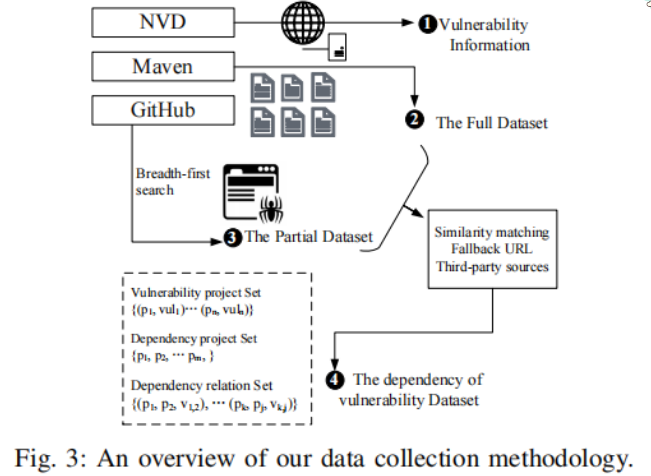
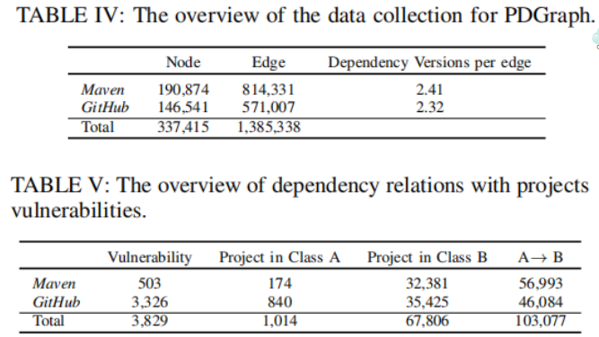
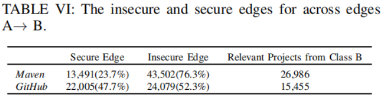

# Paper Reading-NPM

针对不安全项目依赖的大规模实证研究
<!--more-->

> *原文标题：PDGraph: A Large-Scale Empirical Study on Project Dependency of Security Vulnerabilities*
>
> *原文作者：Qiang Li; Jinke Song; Dawei Tan; Haining Wang; Jiqiang Liu*
>
> *原文链接：https://ieeexplore.ieee.org/document/9505106*
>
> *原文来源：DSN'21*

## 简介
代码重用可能带来潜在的安全问题，不同的软件项目可能同时由相互依赖的重用组件引入漏洞。论文通过构建一个新的项目依赖关系图PDGraph，对项目依赖关系与安全漏洞进行了首次大规模实证研究。

## 挑战
- 项目的构建文件只提供分离的依赖关系，需要遍历项目重用库中的构建文件才能获得完整的依赖关系。
  - 解决：将依赖关系分为 Full/Whole Dataset (Maven) 和 Partial Dataset (GitHub) 两类
- 如何整合不同来源数据集(NVD、Maven、GitHub)的信息来判断项目是否存在漏洞。
  - 解决：对漏洞信息和项目依赖间的一致性进行了量化

## 方法
A.数据收集
- 依赖关系
  - Maven：解析pom.xml建立有向边
  - GitHub：针对Java、Ruby、Python、.NET、JavaScript五种语言不同的依赖声明文件，借助API爬取依赖声明文件。将GitHub数据集分为三类：A类(涉及漏洞的项目)、B类(直接使用A类项目库的项目)、C类(间接使用A类项目库的项目)
- 关联漏洞
  - 相似度匹配：统计文本特征提取相关词，使用Levenshtein距离计算Maven、GitHub项目描述和CPE间相似度。
  - URL：比较NVD漏洞报告中的url与Maven、GitHub项目的url。
  - 第三方数据：Advisory database、CVE、 manually-curated dataset。

B. 构建项目依赖图  
- 定义四项指标评估依赖风险：依赖项目数量、依赖该项目的项目数量、依赖路径长度、循环依赖。  
- 生成依赖图，通过SCC简化PDGraph，利用MFAS保证局部图的层次结构，然后对于每个SCC生成有向无环图DAG.
- 检测不安全的边：正则匹配依赖关系边缘中的需求版本和漏洞版本。 

## 实验
数据集：

不安全边发现：

## 总结
论文构建了第一个针对安全漏洞的项目依赖图，发现了大量由于项目依赖而引入的不安全边，可以为代码审计、防御代码重用攻击等提供帮助。但仍存在一些不足：
- PDGraph基于项目构建文件创建，可能存在人为错误；
- PDGraph目前不支持构建C和C++项目依赖；
- 并非所有漏洞都是可传递的，现有的不安全边可能存在误报；
- 定义的四项依赖风险评估指标有待完善。
