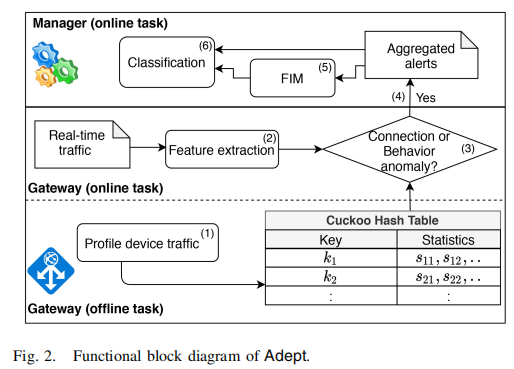
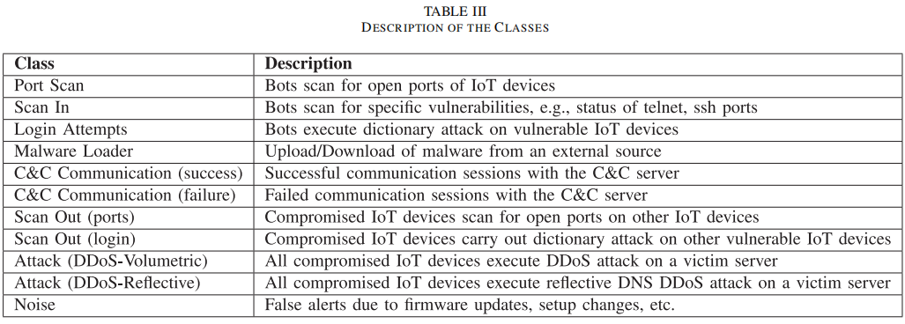
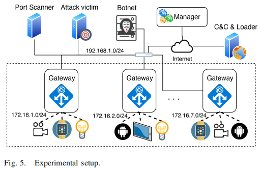
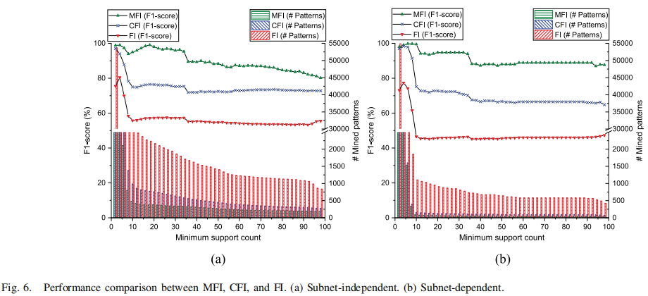
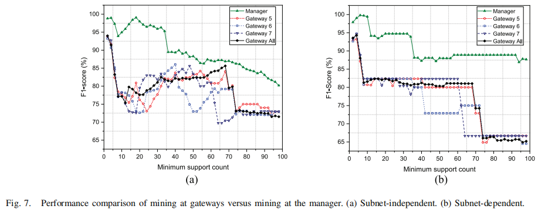
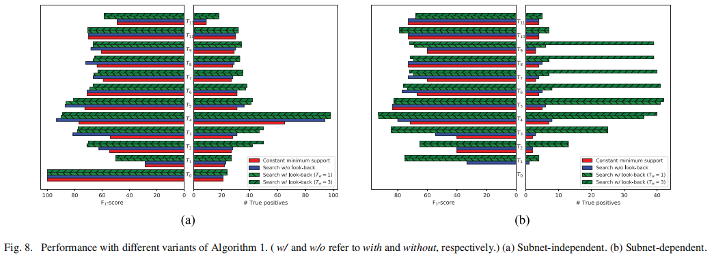
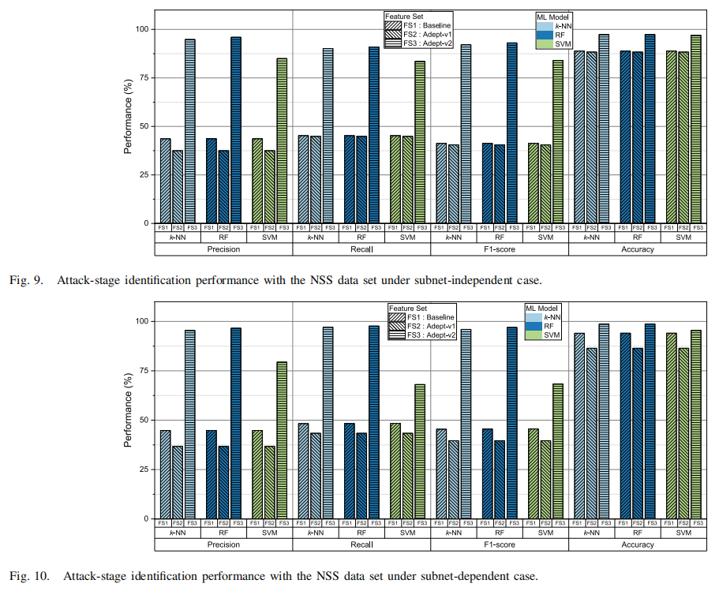

物联网相关攻击阶段的检测和识别
<!--more-->

> *原文标题：ADEPT: Detection and identification of correlated attack stages in IoT networks*
>
> *原文作者：Sudheera K L K, Divakaran D M, Singh R P, et al.*
>
> *原文链接：https://ieeexplore.ieee.org/abstract/document/9343343*
>
> *发表期刊：IEEE INTERNET OF THINGS JOURNAL'21*

## 简介
针对物联网相关攻击阶段识别面临的时间分散和空间分散两大挑战，论文提出了一个分布式框架ADEPT，可以跨时间和空间关联可疑活动并将其分类为可能的攻击阶段。

## 方法

ADEPT框架分为三阶段  

- 第一阶段：通过物联网网关设备检测各种异常。
  - 离线操作：建立哈希表存储与网关连接的物联网设备的配置表以检测设备变化，由于设备的正常行为可能随时间推移而改变，例如固件更新，因此定期(几天为周期)更新哈希表。
  - 在线操作：分析设备流量以检测异常(连接异常和行为异常)，生成流量异常的元信息(警报)，网关向上只发送警报。减少了带宽消耗和私人信息泄露风险。  
- 第二阶段：处理和关联不同网关产生的警报。
  - 基于频繁项集挖掘(FIM)提取攻击阶段相对应的模式同时过滤由于固件更新等产生的虚假警报。
  - 提出了一种基于滑动窗口的挖掘算法，基于当前时间窗口中发现的新模式来发现先前时间窗口中遗漏的模式，使得ADEPT能考虑到时间相关性。
- 第三阶段：使用警报级别和模式级别的特征训练基于机器学习的多分类模型。
  - 警报级别特征：源IP和目的IP、网络流向、协议。
  - 模式级别特征：IP和端口流量方向、向内和向外的平均数据包大小、FIM阶段的支持度、源节点与目标节点的数量比、每个IP的交互端口数量、模式识别中的特殊属性、实体。
  - 攻击阶段类别：
  

  
## 实验
作者模拟了一个物联网网络和Mirai攻击环境，实验装置：一台安全管理器、65台IoT设备、一台靶机、两个外部僵尸网络、一台C&C服务器、一台装载机、一组虚拟机(触发警报)。

- 实验一：对比了对警报应用子网划分和不应用子网划分两种IP地址表示方法对效果的影响，应用子网划分方式的F1值更高且能识别出更多的模式。

- 实验二：测试空间相关性在攻击阶段检测中的影响，即是否通过安全管理器装置关联不同网关的警告，实验表明安全管理器效果更好。

- 实验三：时间相关性影响，基于滑动窗口方法的效果最好。

- 攻击阶段识别

进一步，作者在IoT23-43数据集和混合数据集上进行实验，均取得了较好的实验结果。
